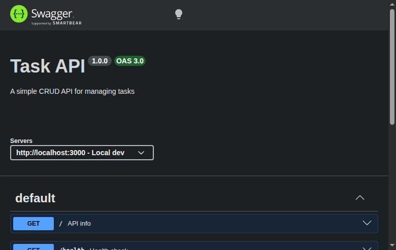

# Task API

A simple CRUD API for managing a to-do list, built with Node.js and Express.

## Install & Run

```bash
npm install
node server.js
```

Server starts at `http://localhost:3000`.

## Endpoints

| Method | Path | Description | Status codes |
|--------|------|-------------|-------------|
| GET | `/` | API metadata | 200 |
| GET | `/health` | Health check | 200 |
| GET | `/tasks` | List all tasks | 200 |
| GET | `/tasks/:id` | Get one task | 200, 404 |
| POST | `/tasks` | Create a task | 201, 400 |
| PUT | `/tasks/:id` | Update a task | 200, 400, 404 |
| DELETE | `/tasks/:id` | Delete a task | 204, 404 |

## Example curl output

```bash
$ curl -i -X POST http://localhost:3000/tasks -H "Content-Type: application/json" -d '{"title":"Buy milk"}'

HTTP/1.1 201 Created
Content-Type: application/json; charset=utf-8

{"id":4,"title":"Buy milk","done":false}
```

## Swagger UI

Open `http://localhost:3000/docs` in your browser to see and test all endpoints interactively.



## In-memory storage

Data lives in a JavaScript array. Restarting the server resets to the 3 example tasks — there is no database yet.
