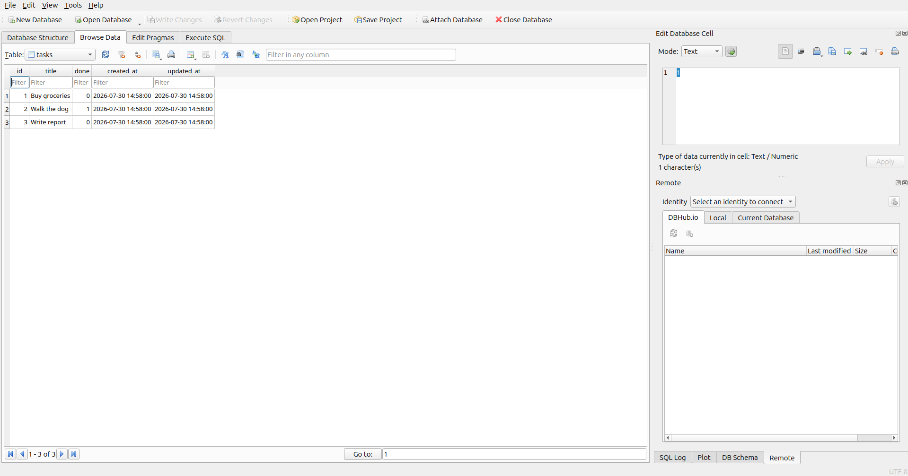

# Task API — SQLite

A CRUD API for managing a to-do list, backed by SQLite instead of in-memory storage. Data survives server restarts.

## Why SQLite?

- Zero configuration — no server to install or manage.
- The entire database is a single file (`tasks.db`).
- Perfect for development, prototyping, and small-scale use.
- Easy to inspect with any SQLite viewer (e.g. DB Browser for SQLite).

## Database file

The database is stored in `tasks.db` in the project root. It is automatically created on first run.

## Install & Run

```bash
npm install
npm start
```

Server starts at `http://localhost:3000`.

## Endpoints

| Method | Path | Description | Status codes |
|--------|------|-------------|-------------|
| GET | `/` | API metadata | 200 |
| GET | `/health` | Health check | 200 |
| GET | `/tasks` | List all tasks | 200 |
| GET | `/tasks/:id` | Get one task | 200, 404 |
| POST | `/tasks` | Create a task | 201, 400 |
| PUT | `/tasks/:id` | Update a task | 200, 400, 404 |
| DELETE | `/tasks/:id` | Delete a task | 204, 404 |
| GET | `/stats` | Task statistics | 200 |

### Query parameters for GET /tasks

| Param | Example | Description |
|-------|---------|-------------|
| `search` | `?search=milk` | Filter tasks whose title contains the string |
| `done` | `?done=true` | Filter by completion status |
| `sort` | `?sort=title` | Sort alphabetically by title (defaults to by id) |

These can be combined: `?done=false&search=Buy&sort=title`

## Example SQL queries

List every task:
```sql
SELECT * FROM tasks;
```

Show only completed tasks:
```sql
SELECT * FROM tasks WHERE done = 1;
```

Count all tasks:
```sql
SELECT COUNT(*) FROM tasks;
```

Mark every task as completed:
```sql
UPDATE tasks SET done = 1;
```

Delete all completed tasks:
```sql
DELETE FROM tasks WHERE done = 1;
```

Search tasks by keyword:
```sql
SELECT * FROM tasks WHERE title LIKE '%groceries%';
```

## Swagger UI

Open `http://localhost:3000/docs` in your browser to see and test all endpoints interactively.

## Screenshot


