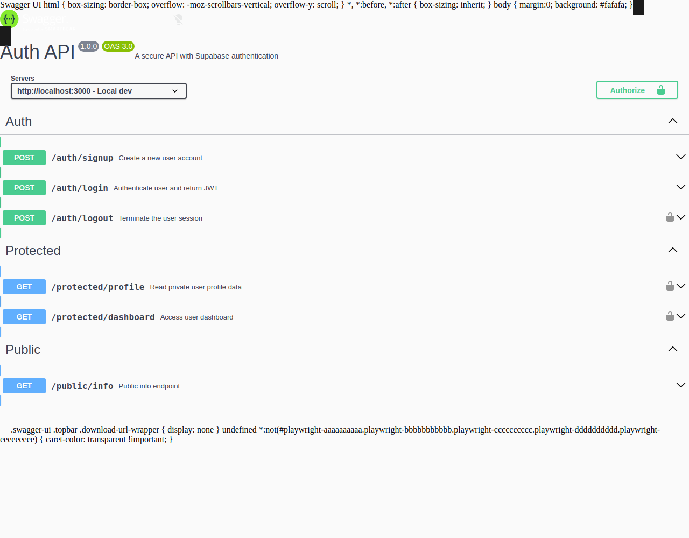

# Auth API — Secure API with Supabase Authentication

A secure REST API built with **Node.js**, **Express**, and **Supabase Auth**. Users can sign up, log in, and access protected routes using JSON Web Tokens (JWTs).

## Features

- **Sign Up** — Register a new user account
- **Log In** — Authenticate and receive a JWT access token
- **Log Out** — Revoke the session
- **Protected Routes** — Access user data only with a valid bearer token
- **Public Routes** — Open endpoints that require no authentication
- **Swagger UI** — Interactive API documentation at `/docs`

## Tech Stack

- Node.js + Express
- Supabase Auth (Identity Provider)
- Swagger UI Express
- dotenv

## Setup

### Prerequisites

- Node.js 18+
- A Supabase project (free tier at [supabase.com](https://supabase.com))

### Environment Variables

Create a `.env` file in the project root:

```env
SUPABASE_URL=https://your-project-id.supabase.co
SUPABASE_KEY=your-anon-key-here
PORT=3000
```

| Variable       | Description                          |
| -------------- | ------------------------------------ |
| `SUPABASE_URL` | Your Supabase project URL            |
| `SUPABASE_KEY` | Your Supabase anon/public API key    |
| `PORT`         | Port the server listens on (default 3000) |

> **Never commit your `.env` file.** It's already in `.gitignore`.

### Install & Run

```bash
npm install
npm start
```

The server starts at `http://localhost:3000` and Swagger UI at `http://localhost:3000/docs`.

## API Reference

| Method | Endpoint              | Auth Required | Description                        |
| ------ | --------------------- | ------------- | ---------------------------------- |
| POST   | `/auth/signup`        | No            | Create a new user account          |
| POST   | `/auth/login`         | No            | Authenticate and receive JWT tokens |
| POST   | `/auth/logout`        | Yes           | Revoke the current session         |
| GET    | `/protected/profile`  | Yes           | View your profile (id, email, created_at) |
| GET    | `/protected/dashboard`| Yes           | Access your dashboard              |
| GET    | `/public/info`        | No            | Public welcome message             |

### Status Codes

| Status | Meaning                    |
| ------ | -------------------------- |
| 200    | Success                    |
| 201    | Created (signup)           |
| 204    | No Content (logout)        |
| 400    | Bad Request (missing fields) |
| 401    | Unauthorized (invalid/missing token) |

### Testing with curl

```bash
# Sign up
curl -i -X POST http://localhost:3000/auth/signup \
  -H "Content-Type: application/json" \
  -d '{"email":"test@example.com","password":"password123"}'

# Log in
curl -i -X POST http://localhost:3000/auth/login \
  -H "Content-Type: application/json" \
  -d '{"email":"test@example.com","password":"password123"}'

# Access protected route (replace <token>)
curl -i http://localhost:3000/protected/profile \
  -H "Authorization: Bearer <token>"

# Public route (no auth)
curl -i http://localhost:3000/public/info
```

## Swagger UI

Open `http://localhost:3000/docs` in your browser. Click the **Authorize** button (lock icon) and paste your JWT access token to test protected endpoints directly.



## Project Structure

```
├── .env.example          # Environment variable template
├── package.json
├── openapi.json          # OpenAPI/Swagger specification
├── README.md
└── src/
    ├── server.js         # Express server entry point
    ├── supabaseClient.js # Supabase client initialization
    ├── middleware/
    │   └── auth.js       # Bearer token verification middleware
    └── routes/
        ├── authRoutes.js      # /auth/* routes
        ├── protectedRoutes.js # /protected/* routes
        └── publicRoutes.js    # /public/* routes
```

## Security

- Passwords are **never stored or handled** by this server — Supabase handles hashing and storage
- JWTs are verified server-side using `supabase.auth.getUser()`
- Protected routes use reusable middleware — no duplicated auth logic
- Environment variables keep secrets out of source code
